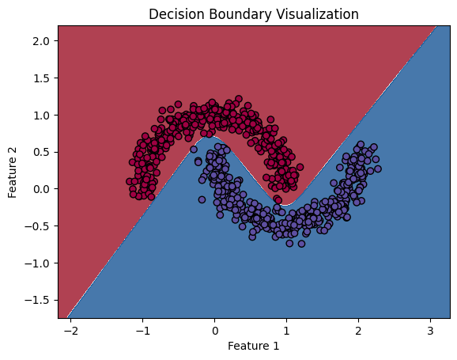

# 🧠 Deep Learning Specialization – Experiments & Notes

* This repository contains my hands-on implementations, visualizations, and insights as I progress through the **Deep Learning Specialization**. 
* The goal is to build a strong intuition for how deep learning works by implementing core concepts from scratch and building small, meaningful experiments along the way.

## 📘 About This Repository

This repo is structured as a **learning lab** — combining notebooks, notes, and experiments that align with the specialization curriculum.

## ✅ Current Progress

### Implementing Neural Networks From Scratch
It focuses on:
- Implementing neural networks from scratch
- Visualizing activations and gradients
- Deepening conceptual understanding through small POCs
- Documenting insights and learnings for future reference

[notebooks/00_understanding_neural_networks.ipynb](https://github.com/gaurangdave/deep_learning_specialization/blob/main/notebooks/00_understanding_neural_networks.ipynb)

This notebook implements a simple **2-layer neural network** from scratch (using only NumPy) on the `moons` dataset. Features include:
- Forward and backward propagation
- Use of `tanh` for hidden layer and `sigmoid` for output
- Training with gradient descent
- Visualizations of activations and decision boundaries

#### Shaping the Space: Linear Transformations Before Activation
> Watch how weights and biases transform input space in the hidden layer before activation functions kick in.


#### Bringing Neurons to Life: Hidden Layer Activations
> Visualizing how each hidden neuron reacts to inputs — lime lines represent positive activations, red lines indicate negative activations, and line thickness + opacity show activation strength (the higher the magnitude, the bolder and brighter the line).


#### Decision Boundry



## 💻 Tech Stack

  


## 🔧 Setup Instructions

### Python version
```bash
Python 3.12.9
```
### Install Dependencies
```bash
pip install -r requirements.txt
```
## 📂 Folder Structure (WIP)
```
deep_learning_specialization/
├── notebooks/             # Jupyter notebooks for experiments
├── visualizations/        # Visualizations and animations for various POCs
├── requirements.txt       # All required dependencies
├── README.md              # This file
└── ...                    # More modules coming soon!
```
## 🚧 Upcoming Plans
* Experiment with more noisy and complex datasets
* Implement multi-layer neural networks with flexible architecture
* Integrate other activation functions and experiment with training dynamics
* Add utilities for plotting and monitoring
* Tidy up reusable functions for mini deep learning framework

## ✍️ Author

Built with patience, curiosity, and coffee ☕ by Gaurang Dave.

## 📜 License
This project is for educational purposes. Feel free to fork and use any code with attribution. ❤️